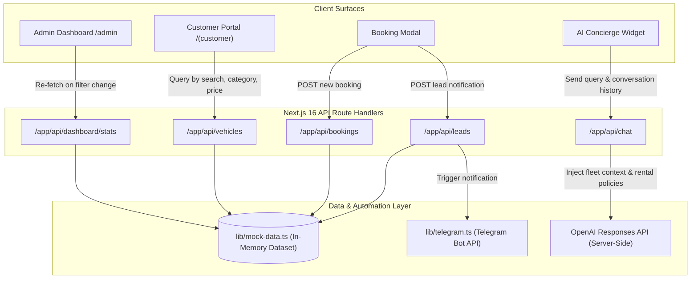

# LuxeDrive — System Architecture & Data Flow

## 1. Directory Structure Overview

The repository is architected as a single Next.js 16 App Router application utilizing Route Groups to isolate the customer-facing portal and the administrative back-office while sharing components, mock data stores, and API endpoints.

```
prac/
├── app/
│   ├── (customer)/                # Customer-Facing Public Website
│   │   ├── layout.tsx             # Navbar + Footer + Floating AI Concierge
│   │   ├── page.tsx               # Storefront: Hero Search, Featured Cars, FAQ
│   │   └── vehicles/
│   │       ├── page.tsx           # Vehicle Catalogue with Live Filter Sidebar
│   │       └── [id]/
│   │           └── page.tsx       # Vehicle Detail Page + Booking Modal
│   ├── admin/                     # Executive Admin Portal
│   │   ├── layout.tsx             # Persistent Sidebar & Role Wrapper
│   │   ├── page.tsx               # Dashboard Home (Metrics, Charts, Table)
│   │   ├── vehicles/
│   │   │   └── page.tsx           # Fleet Asset Register Management
│   │   ├── bookings/
│   │   │   └── page.tsx           # Bookings Manifest & Status Filtering
│   │   └── leads/
│   │       └── page.tsx           # Inquiries CRM & Automation Notification Logs
│   ├── api/                       # Mock API Route Handlers
│   │   ├── dashboard/stats/
│   │   │   └── route.ts           # Dynamic revenue & booking stats
│   │   ├── vehicles/
│   │   │   ├── route.ts           # Fleet listing with query filtering
│   │   │   └── [id]/route.ts      # Single vehicle lookup by ID
│   │   ├── bookings/
│   │   │   └── route.ts           # Bookings query and reservation creation
│   │   ├── leads/
│   │   │   └── route.ts           # Lead intake & Telegram automation trigger
│   │   └── chat/
│   │       └── route.ts           # OpenAI Responses API server-side endpoint
│   ├── globals.css                # Tailwind CSS v4 CSS-first @theme inline setup
│   └── layout.tsx                 # Root layout with font and metadata
├── components/
│   ├── admin/                     # Dedicated Admin Dashboard Components
│   │   ├── AdminHeader.tsx        # Top navigation, status indicator, refresh
│   │   ├── AdminSidebar.tsx       # Sticky sidebar navigation
│   │   ├── BookingsTable.tsx      # Reservation data table with status badges
│   │   ├── DashboardFilters.tsx   # Filter dropdowns (Date Range, Category)
│   │   ├── RevenueChart.tsx       # Recharts Area & Bar visualization
│   │   └── StatsCards.tsx         # 4-card metric overview
│   ├── customer/                  # Customer Storefront Components
│   │   ├── BookingModal.tsx       # Reservation checkout with date calculation
│   │   ├── ChatBotWidget.tsx      # AI Concierge floating chat widget
│   │   ├── CustomerFooter.tsx     # Footer with policies and quick links
│   │   ├── CustomerNavbar.tsx     # Top responsive navigation
│   │   ├── HeroSection.tsx        # Hero banner with integrated search
│   │   ├── VehicleCard.tsx        # Vehicle card with specs & action buttons
│   │   ├── VehicleFilters.tsx     # Category, price range, and transmission filters
│   │   └── VehicleGrid.tsx        # Responsive vehicle grid with loading state
│   └── ui/                        # shadcn/ui Tailwind v4 primitives
├── lib/
│   ├── mock-data.ts               # In-memory mock store and filter utilities
│   ├── telegram.ts                # Telegram Bot API & webhook notification helper
│   ├── types.ts                   # Core TypeScript domain entities
│   └── utils.ts                   # Class name merger (clsx + twMerge)
├── .env.local.example             # Documented environment variables
├── ARCHITECTURE.md                # System design & data flow document
├── PROJECT.md                     # Requirements & evaluation breakdown
├── README.md                      # Submission guide & run instructions
└── TODO.md                        # 3-day development timeline & checklist
```

---

## 2. End-to-End Data Flow



---

## 3. Key Subsystem Details

### A. Dynamic Mock Data Layer
- Instead of static JSON dumps, `/lib/mock-data.ts` acts as a parameterized in-memory data store.
- Supports real-time filtering: search queries, price ranges, seat capacity, transmission types, fuel types, date ranges, and category breakdown calculations.

### B. AI Rental Concierge (`/app/api/chat`)
- Uses the **OpenAI Responses API** server-side to ensure `OPENAI_API_KEY` is never exposed in the browser bundle.
- Configurable model via `OPENAI_MODEL` environment variable (defaults to current flagship `gpt-5.5`).
- Injects authoritative rental policies (age limits, deposits, insurance, cancellations) and active vehicle catalogue into the model's system instructions.
- Evaluates customer requirements (trip duration, passengers, budget) and returns structured vehicle recommendations.
- Includes a graceful fallback simulation engine for evaluation environments without an active OpenAI API key.

### C. Automation & Lead Workflow (`/app/api/leads`)
- When a customer submits a booking inquiry or reservation, `/app/api/leads` receives the payload.
- Automatically formats a markdown notification ticket containing customer contact info, dates, vehicle selection, and special notes.
- Dispatches the alert to a designated operations channel via the Telegram Bot API (`https://api.telegram.org/bot<TOKEN>/sendMessage`).
- Provides a clean fallback log to console for development environments.
