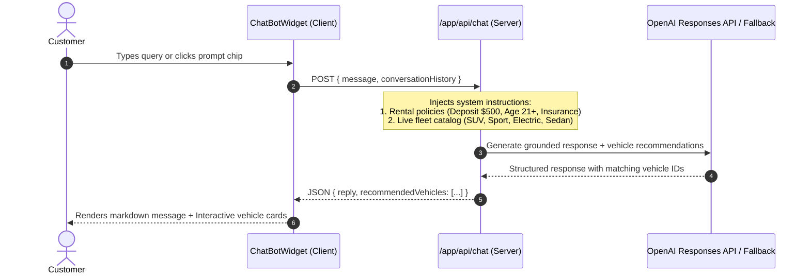
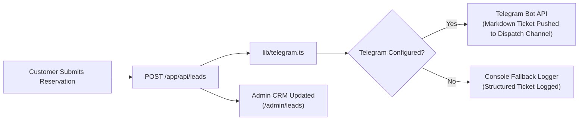

# LuxeDrive — Luxury Car Rental Platform & Fleet Operations Dashboard

> **Technical Assessment Submission**: Web Designer/Developer + AI Automation  
> **Current Project Stage**: Stage 3 (Production-Ready Full-Stack Implementation Complete)  
> **Evaluation Date**: August 2026  
> **Repository Architecture**: Single Next.js 16 App Router Monorepo (Customer Storefront + Executive Admin Suite + AI Concierge + Telegram Automation)  
> **Live Demo Target**: `https://luxedrive-assessment.vercel.app`

---

## 📌 Executive Summary & Current Stage

**LuxeDrive** is a production-grade luxury car rental platform and operations command center engineered with **Next.js 16 (App Router, Turbopack, React 19)**, **Tailwind CSS v4**, **shadcn/ui**, **Recharts**, **OpenAI Responses API**, and an automated **Telegram notification pipeline**.

### 🚀 Current Stage: Stage 3 Complete (Full Delivery)
- [x] **Stage 1 (Architecture & Design System)**: Complete directory structure, Route Groups `(customer)` and `admin`, Tailwind CSS v4 CSS-first design tokens in `app/globals.css`, shadcn/ui primitives, and TypeScript domain models in `lib/types.ts`.
- [x] **Stage 2 (Interactive Portal & Analytics Dashboard)**: Dynamic mock data engine (`lib/mock-data.ts`), multi-filter vehicle catalog (`/vehicles`), dynamic vehicle detail pages (`/vehicles/[id]`), interactive date-range & pricing booking flow (`BookingModal.tsx`), and the Executive Admin Dashboard (`/admin`) with live KPI metrics, Recharts revenue & category graphs, dynamic date/category filters, fleet inventory management, bookings manifest, and leads CRM.
- [x] **Stage 3 (AI Concierge & Automation Pipeline)**: Server-side OpenAI Responses API route handler (`/app/api/chat`) with domain-grounded rental policies and dynamic vehicle match cards, floating client chat widget (`ChatBotWidget.tsx`), and automated multi-channel lead dispatch (`/app/api/leads` + `lib/telegram.ts`) delivering instant reservation tickets via Telegram Bot API with development fallback simulation.

---

## 🗂️ Complete Folder & Project Structure

Below is the complete tree layout of the LuxeDrive repository with descriptions for every component and subsystem:

```
prac/
├── app/                                  # Next.js 16 App Router root directory
│   ├── (customer)/                       # Route Group: Public Customer-Facing Portal
│   │   ├── layout.tsx                    # Customer layout (CustomerNavbar, CustomerFooter, ChatBotWidget)
│   │   ├── page.tsx                      # Storefront Landing Page (Hero Search, Featured Fleet, FAQ, Policies)
│   │   └── vehicles/                     # Vehicle Directory & Browsing
│   │       ├── page.tsx                  # Fleet Catalog with live Search, Category Pills & Price Slider
│   │       └── [id]/                     # Dynamic Vehicle Detail Route
│   │           └── page.tsx              # Vehicle Showcase, Specs Grid, Features & Booking Modal trigger
│   │
│   ├── admin/                            # Route Group: Executive Back-Office & Operations Portal
│   │   ├── layout.tsx                    # Admin layout with sticky AdminSidebar & AdminHeader
│   │   ├── page.tsx                      # Executive Dashboard Overview (StatsCards, RevenueChart, BookingsTable)
│   │   ├── vehicles/                     # Admin Fleet Register
│   │   │   └── page.tsx                  # Fleet asset management table, availability toggles & search
│   │   ├── bookings/                     # Admin Bookings Manifest
│   │   │   └── page.tsx                  # Reservation management table with status tabs (Active/Confirmed/Pending)
│   │   └── leads/                        # Admin Inquiries & CRM
│   │       └── page.tsx                  # Inbound customer leads, channel badges & Telegram dispatch logs
│   │
│   ├── api/                              # Next.js Server-Side Route Handlers (REST & AI endpoints)
│   │   ├── dashboard/                    # Admin Dashboard Metrics API
│   │   │   └── stats/
│   │   │       └── route.ts              # Returns dynamic revenue, active bookings, utilization & Recharts data
│   │   ├── vehicles/                     # Fleet Query API
│   │   │   ├── route.ts                  # Filterable vehicle catalog (search, category, price, transmission, fuel)
│   │   │   └── [id]/
│   │   │       └── route.ts              # Single vehicle lookup by ID with 404 handling
│   │   ├── bookings/                     # Bookings API
│   │   │   └── route.ts                  # Query bookings manifest (status filtering) & create new reservations
│   │   ├── leads/                        # Lead Intake & Automation Route
│   │   │   └── route.ts                  # Ingests leads & triggers automated Telegram alerts via lib/telegram.ts
│   │   └── chat/                         # AI Concierge Backend Route
│   │       └── route.ts                  # OpenAI Responses API server-side handler with policy system instructions
│   │
│   ├── favicon.ico                       # Platform favicon
│   ├── globals.css                       # Tailwind CSS v4 CSS-first design system with @theme inline tokens
│   └── layout.tsx                        # Global root layout with Inter font, metadata, and HTML skeleton
│
├── components/                           # Modular React UI Components
│   ├── admin/                            # Executive Dashboard Specific Components
│   │   ├── AdminHeader.tsx               # Top admin bar with breadcrumbs, system status badge & refresh trigger
│   │   ├── AdminSidebar.tsx              # Collapsible sticky sidebar navigation with active route highlights
│   │   ├── BookingsTable.tsx             # Reservation manifest table with status badges & customer details
│   │   ├── DashboardFilters.tsx          # Interactive filter controls (7d/30d/90d timeframe & category select)
│   │   ├── RevenueChart.tsx              # Recharts Area Chart (Revenue trends) & Bar Chart (Category distribution)
│   │   └── StatsCards.tsx                # 4-card KPI metric overview (Revenue, Bookings, Fleet, Leads)
│   │
│   ├── customer/                         # Customer Storefront Specific Components
│   │   ├── BookingModal.tsx              # Multi-step checkout modal with real-time day/price calculation
│   │   ├── ChatBotWidget.tsx             # Floating AI Concierge assistant with quick-prompt chips & vehicle cards
│   │   ├── CustomerFooter.tsx            # Footer with brand links, rental policies, contact & newsletter
│   │   ├── CustomerNavbar.tsx            # Responsive glassmorphism navigation with mobile drawer
│   │   ├── HeroSection.tsx               # Hero banner with background backdrop & quick fleet search bar
│   │   ├── VehicleCard.tsx               # Vehicle card featuring specs, pricing, badge status & CTA buttons
│   │   ├── VehicleFilters.tsx            # Sidebar filters (Search, Categories, Price Slider, Transmission, Fuel)
│   │   └── VehicleGrid.tsx               # Responsive vehicle collection grid with empty & loading states
│   │
│   └── ui/                               # shadcn/ui Tailwind v4 Primitives
│       ├── avatar.tsx                    # Avatar and fallback badge
│       ├── badge.tsx                     # Status and category badges
│       ├── button.tsx                    # Button with primary, secondary, outline, destructive & ghost variants
│       ├── calendar.tsx                  # Date picker calendar component
│       ├── card.tsx                      # Card container, header, content, footer
│       ├── dialog.tsx                    # Modal dialog overlay and content wrapper
│       ├── dropdown-menu.tsx             # Dropdown menus and action triggers
│       ├── input.tsx                     # Form text and search inputs
│       ├── popover.tsx                   # Popover wrapper for dropdowns and date pickers
│       ├── select.tsx                    # Form select dropdown
│       ├── separator.tsx                 # Visual divider component
│       ├── sheet.tsx                     # Slide-over sheet for mobile drawers
│       ├── table.tsx                     # Clean, accessible data table component
│       └── tabs.tsx                      # Navigational tabs for filtering views
│
├── lib/                                  # Shared Utilities, Data Store, & Helper Libraries
│   ├── mock-data.ts                      # Parameterized in-memory dataset (Vehicles, Bookings, Leads, Metrics)
│   ├── telegram.ts                       # Telegram Bot API notification service & fallback webhook logger
│   ├── types.ts                          # Strict TypeScript domain interfaces (Vehicle, Booking, Lead, Metric)
│   └── utils.ts                          # Utility functions (cn class merger with clsx and tailwind-merge)
│
├── public/                               # Static assets, vehicle images, and SVG illustrations
├── .env.local.example                    # Sample environment variables template (OpenAI, Telegram, App URL)
├── .gitignore                            # Standard git ignore configuration
├── ARCHITECTURE.md                       # Comprehensive architecture document with Mermaid diagrams
├── PROJECT.md                            # Technical requirements and assessment evaluation rubric mapping
├── README.md                             # Primary project documentation, folder guide & setup instructions
├── TODO.md                               # 3-day execution roadmap and development checklist
├── components.json                       # shadcn/ui configuration file
├── eslint.config.mjs                     # ESLint configuration
├── next.config.ts                        # Next.js configuration (Server Actions, Image domains)
├── package.json                          # Project dependencies, scripts & metadata
├── postcss.config.mjs                    # PostCSS configuration for @tailwindcss/postcss
└── tsconfig.json                         # TypeScript configuration with strict mode & path aliases (@/*)
```

---

## 🛠️ Technology Stack

| Layer | Technology | Version / Specification | Rationale |
|---|---|---|---|
| **Framework** | Next.js (App Router) | `16.3.3` | Server Components, Route Groups, fast Turbopack compilation |
| **Runtime / Library** | React | `19.0.0` | Modern hooks, transitions, and native streaming |
| **Language** | TypeScript | `5.x` | Strict type safety across domain models and API payloads |
| **Styling Engine** | Tailwind CSS | `v4.0` | CSS-first architecture with `@theme inline` design tokens |
| **Component Primitives**| shadcn/ui | Tailwind v4 Compatible | Accessible, unstyled, composable primitives (Radix UI) |
| **Data Visualization** | Recharts | `2.15.x` | Interactive Area Chart (Revenue) & Bar Chart (Fleet split) |
| **Icons** | Lucide React | `0.475.x` | Consistent, lightweight SVG iconography |
| **AI Integration** | OpenAI Responses API | `openai ^4.85` | Server-side structured reasoning & catalogue grounding |
| **Automation Channel** | Telegram Bot API | Standard REST | Instant markdown reservation dispatch tickets |
| **Deployment Target** | Vercel | Production | Zero-config edge deployment with optimized serverless routes |

---

## 🚀 Getting Started & Local Setup

### 1. Prerequisites
- **Node.js**: `20.x` or higher (LTS recommended)
- **Package Manager**: `npm`, `pnpm`, or `yarn`

### 2. Installation
```bash
# Clone the repository
git clone <YOUR_REPO_URL>
cd prac

# Install project dependencies
npm install
```

### 3. Environment Configuration
Create a `.env.local` file by copying the provided example:
```bash
cp .env.local.example .env.local
```

Populate the configuration variables in `.env.local`:
```env
# ----------------------------------------------------
# 1. OpenAI Responses API Configuration (Server-Side)
# ----------------------------------------------------
OPENAI_API_KEY=sk-your-actual-openai-api-key
OPENAI_MODEL=gpt-5.5

# ----------------------------------------------------
# 2. Telegram Bot Automation Pipeline (Optional)
# ----------------------------------------------------
TELEGRAM_BOT_TOKEN=123456789:ABCdefGhIJKlmNoPQRstuVWXyz
TELEGRAM_CHAT_ID=-1001234567890

# ----------------------------------------------------
# 3. Application Base URL
# ----------------------------------------------------
NEXT_PUBLIC_APP_URL=http://localhost:3000
```

> **💡 Zero-Config Fallback**: If no OpenAI API key or Telegram Bot credentials are provided, LuxeDrive automatically activates its built-in **intelligent fallback simulation engines**. The AI Concierge and Lead Dispatch workflows remain 100% interactive and evaluatable out of the box!

### 4. Running the Application
```bash
# Start Next.js development server with Turbopack
npm run dev
```

Open [http://localhost:3000](http://localhost:3000) in your browser.

### 5. Production Build & Verification
```bash
# Compile and test production build
npm run build
npm run start
```

---

## 🧭 Application Surfaces & Route Map

### 🚘 Customer-Facing Portal
| Route | Surface | Key Features |
|---|---|---|
| `/` | Storefront Home | Hero search bar, featured vehicle carousel, category tabs, customer reviews & rental policy breakdown. |
| `/vehicles` | Vehicle Catalog | Real-time search query filter, category filter buttons, interactive price slider, transmission & fuel selectors. |
| `/vehicles/[id]` | Vehicle Details | High-resolution showcase, technical specifications, included amenities, and instant reservation trigger. |
| `BookingModal` | Global Modal | Interactive date range picker, automatic duration calculation, refundable deposit breakdown, and lead creation. |
| `ChatBotWidget` | Global Floating Widget | AI Rental Concierge with predefined prompt chips, policy FAQ answering, and structured vehicle recommendations. |

### 📊 Executive Operations Portal (Admin)
| Route | Surface | Key Features |
|---|---|---|
| `/admin` | Dashboard Overview | Live KPI cards (Revenue, Bookings, Active Fleet, Leads), Recharts Area Chart for revenue trends, Recharts Bar Chart for fleet distribution, date-range (7d/30d/90d) and category filters, and live bookings table. |
| `/admin/vehicles` | Fleet Asset Register | Comprehensive fleet asset table with status badges (`available`, `rented`, `maintenance`), search filter, and vehicle specifications. |
| `/admin/bookings` | Bookings Manifest | Status-tabbed reservation manifest (`all`, `active`, `confirmed`, `pending`, `completed`) with customer contact details and pricing. |
| `/admin/leads` | Inquiries & Leads CRM | Customer lead intake table showing acquisition channels (`website_form`, `chatbot`, `booking_inquiry`) and Telegram automation delivery logs. |

---

## 🤖 AI Concierge Architecture & Demo Flow

The AI Rental Concierge is integrated server-side using the **OpenAI Responses API** (`openai.responses.create` via `/app/api/chat/route.ts`):



### Try These Prompt Scenarios:
1. **Policy FAQ Inquiry**:  
   - *"What is your security deposit and cancellation policy?"*  
   - ➜ **Response**: Explains the standard $500 refundable deposit and 48-hour free cancellation window.
2. **Personalized Trip Recommendation**:  
   - *"I'm planning a family road trip with 5 passengers and luggage. What do you recommend?"*  
   - ➜ **Response**: Analyzes cabin space, recommending the **BMW X5 M-Sport** or **Tesla Model Y**, displaying interactive cards with specs and "Book Now" buttons.
3. **High-Performance Vehicle Query**:  
   - *"What is the fastest sports car in your fleet?"*  
   - ➜ **Response**: Highlights the **Porsche 911 Carrera GTS** (0-60 mph in 3.2s, 473 hp).

---

## ⚡ Automation & Lead Notification Pipeline

When a customer submits a reservation inquiry via `BookingModal.tsx` or the AI Concierge:



### Sample Automated Telegram Ticket:
```text
🚨 NEW LUXEDRIVE RESERVATION INQUIRY

👤 Customer: Sarah Connor
📧 Email: sarah.c@example.com
📞 Phone: +1 (555) 019-2834
🚘 Vehicle: Porsche 911 Carrera GTS
📅 Dates: Oct 12, 2026 ➔ Oct 15, 2026 (3 Days)
💰 Total Value: $1,470 (Includes $500 Deposit)
📝 Notes: Requesting airport pickup at Terminal 2.
📡 Source: booking_inquiry
```

---

## 📡 API Endpoints Reference

| Method | Endpoint | Description | Query Parameters / Payload |
|---|---|---|---|
| `GET` | `/app/api/dashboard/stats` | Fetches dashboard KPI summary and Recharts data | `timeframe` (`7d`, `30d`, `90d`), `category` (`all`, `suv`, `sport`, etc.) |
| `GET` | `/app/api/vehicles` | Returns filtered fleet catalog | `search`, `category`, `maxPrice`, `transmission`, `fuelType` |
| `GET` | `/app/api/vehicles/[id]` | Returns details for a single vehicle | Route param `[id]` (`v1`, `v2`, etc.) |
| `GET` | `/app/api/bookings` | Returns reservations list | `status` (`all`, `active`, `confirmed`, `pending`, `completed`) |
| `POST` | `/app/api/bookings` | Creates a new customer reservation | `{ vehicleId, customerName, email, phone, startDate, endDate, totalPrice }` |
| `POST` | `/app/api/leads` | Submits a new lead & triggers Telegram alert | `{ customerName, email, phone, vehicleName, startDate, endDate, notes, source }` |
| `POST` | `/app/api/chat` | AI Concierge conversation & recommendation | `{ message, history }` |

---

## 🔮 Future Roadmap & Production Scalability

1. **Persistent Database Layer**: Integrate Prisma ORM with Supabase / PostgreSQL including Row-Level Security (RLS) for multi-tenant car rental agencies.
2. **Payment Gateway Integration**: Connect Stripe Elements / Stripe Checkout for live authorization holds on security deposits and automated rental invoicing.
3. **Real-Time Fleet Telematics**: WebSockets streaming simulation for vehicle GPS coordinates, fuel/battery levels, and odometer logs.
4. **Voice Concierge Agent**: OpenAI Realtime API integration over WebRTC for direct phone and voice-driven car reservations.

---

## 📄 License & Attribution

Developed as an open-source technical assessment for **LuxeDrive Fleet Operations & Car Rental Platform**. Engineered with Next.js 16, Tailwind CSS v4, and OpenAI.
